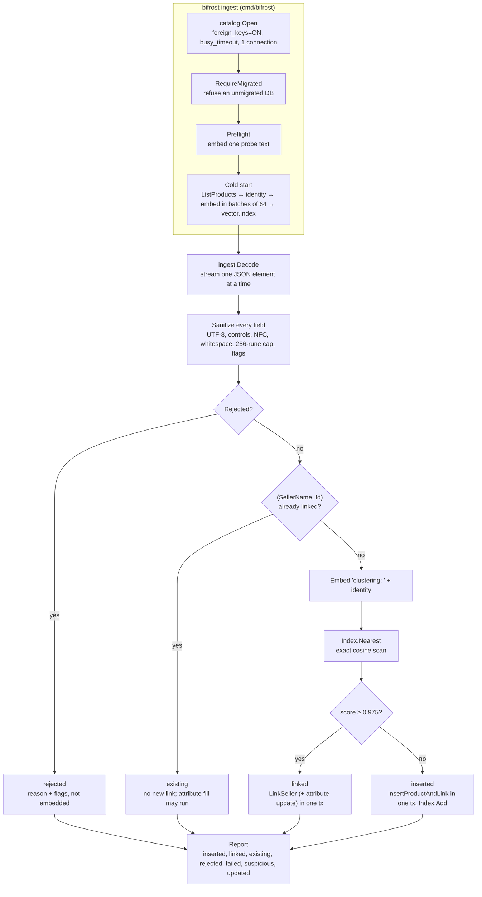
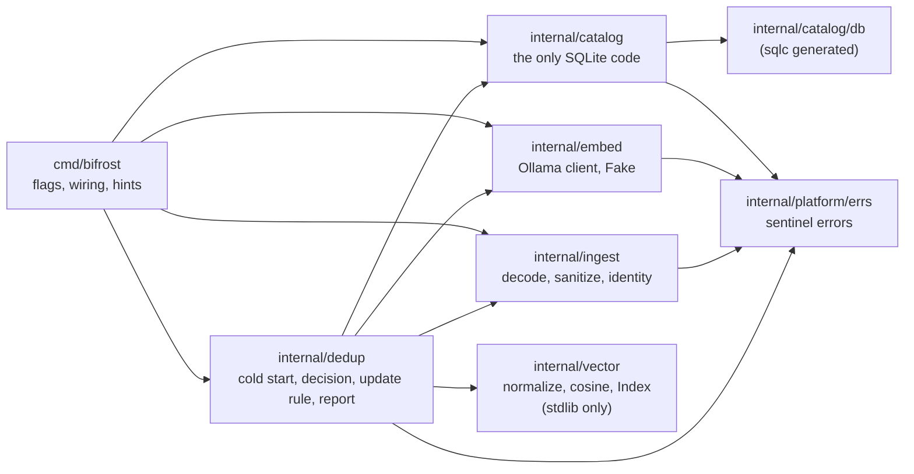
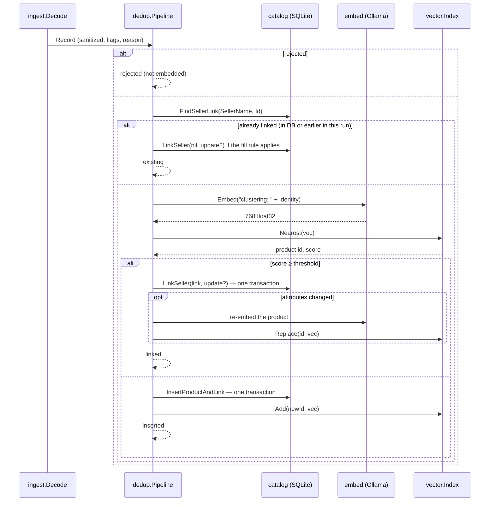

# Bifröst architecture (M1, v0.1.0)

Bifröst ingests seller catalogs (`ProductEntry.json`) into a shared SQLite catalog
(`catalog.db`). For every entry it decides whether the product is already in the catalog,
even under a different name, spelling or language, and links the seller to it, or inserts it as
a new product. The decision is semantic: entries and catalog rows are embedded with a local
model, and the nearest catalog product by cosine similarity decides.

This document describes milestone M1: a local, single-process CLI. Plan:
[M1](milestones/M1.md). Roadmap: [ROADMAP](plans/ROADMAP.md). Data facts:
[data notes](data-notes.md). Decisions: the [ADRs](#adr-index) and the M1 "Decisions" list.

## 1. Context

### Problem

- `catalog.db` holds 975 products and an empty `SellerProduct` link table. Other systems share
  the file, so its table and column names cannot change.
- Sellers send entries with their own ids (UUID-shaped strings), but the legacy
  `SellerProduct.SellerProductId` column is `INTEGER`.
- The input is hostile and messy: malformed ids, a SQL injection payload, doubled spaces,
  accents, inch-mark variants, Portuguese translations of English catalog products, ids that
  repeat across sellers, and the same product sent several times under different ids.
- Exact matching is not enough. "Roteador WiFi 6 TP-Link" is "Router WiFi 6 TP-Link".

### Constraints

| Constraint | Consequence |
| --- | --- |
| Apple M1, 8 GB RAM, shared with the embedding model | Stream the input, float32 vectors, no full-file reads, no second database process |
| Embeddings run locally (Ollama) | No data leaves the machine; the model's first call is slow (cold load) |
| The catalog file is shared with other systems | Keep table and column names; add no tables for audit; migrations are explicit (`bifrost migrate`) |
| The input is untrusted | Every field is sanitized and checked; SQL is parameterized only |
| Wrong links are silent and hard to undo | Precision first: when in doubt, insert and report |

### Out of scope for M1

No HTTP server, no MCP, no queues, no containers, no concurrency. These are milestones M2 to M5
([section 9](#9-known-limits-and-the-path-to-m2-m5)).

## 2. Pipeline



The two commands:

- `bifrost migrate --db PATH` applies the goose migrations, including the `SellerProduct`
  rebuild that makes `SellerProductId` TEXT ([ADR 0001](adr/0001-seller-product-id-text.md)).
- `bifrost ingest --db PATH --input PATH [...]` runs the pipeline above. The flags, defaults and
  exit codes are listed in the [README](../README.md#cli-reference).

## 3. Components

Package boundaries are enforced by depguard in `.golangci.yml`, so `make check` fails when one
is crossed.



| Package | Responsibility | Must not |
| --- | --- | --- |
| `cmd/bifrost` | Parse flags, wire dependencies, print the report, map errors to exit codes and hints | Hold business logic |
| `internal/ingest` | Stream-decode the payload, sanitize fields, validate, flag suspicious content, build the identity string | Use the network or SQL (depguard `ingest-is-offline`, `sql-only-in-catalog`) |
| `internal/embed` | `Embedder` interface; Ollama client over `net/http` (batches of 64, 2 min timeout, 32 MiB response cap); deterministic `Fake` for tests | Use SQL |
| `internal/vector` | Normalize, cosine, an exact in-memory `Index` (`Add`, `Replace`, `Nearest`), `Build` for the cold start | Import anything outside the standard library (depguard `vector-stdlib-only`) |
| `internal/catalog` | Open SQLite, migrate, `RequireMigrated`, plain-typed store methods that own their transactions | Be bypassed: it is the only package that imports `database/sql` or the driver |
| `internal/dedup` | `Pipeline.Run`: preflight, cold start, per-record decision, attribute update rule, `Report` | Import `database/sql` (it talks to `catalog` through the `Store` interface) |
| `internal/platform/errs` | `ErrNotFound`, `ErrConflict`, `ErrInvalidInput`, `ErrUpstream`, `ErrNotMigrated` | |

Dependencies come in through constructors and interfaces (`dedup.Store`, `embed.Embedder`), so
every unit test runs on a fixture copy with `embed.Fake` or a stub and never calls Ollama.

## 4. Data flow

### Identity string

Catalog rows and entries are embedded from the same string, built by `ingest.Identity`:

```
<Name> | brand: <Brand> | category: <Category>
```

A missing Brand or Category drops its segment; there is no "unknown" placeholder, because it
would make every brand-less item look alike. SellerName and Id are excluded. The pipeline embeds
`clustering: <identity>` (the nomic task prefix chosen in [ADR 0002](adr/0002-similarity-threshold.md)).
The format is a contract: `internal/ingest/testdata/ProductEntry.golden.jsonl` pins it for the
whole fixture, and changing it invalidates the threshold.

### One record



- **Transactions.** Each product is written in one transaction (`LinkSeller` or
  `InsertProductAndLink`), so a failure leaves no half-written product or link. A store error
  fails only its record (`failed`, rolled back), and the run continues.
- **The index follows the writes.** A new product goes into the index at once, so a second
  seller sending the same new product in the same run is linked to it, not inserted again.
- **Idempotency.** The key is `(SellerName, Id)`, enforced by a UNIQUE index. The first record
  wins; a repeat is `existing` and is not embedded. Re-running the same input creates nothing.
- **Dry run.** `--dry-run` writes nothing but simulates every write in memory: new products get
  provisional ids (-1, -2, …) and go into the index, and attribute updates are applied to the
  in-memory product map. The dry-run report has the same counts as the real run.
- **What stops the run.** A failed preflight or cold start, a decode error (the payload is not
  one JSON array), an embedding error, or Ctrl-C. The report up to that point is still printed,
  with a hint matched on the cause (`errors.Is`/`errors.As`) and a note that a re-run is safe.

## 5. Decision matrix

| Input | Outcome | Written | Embedded | Report |
| --- | --- | --- | --- | --- |
| Fails validation (missing/blank required field, Id not 8-4-4-4-12 hex, duplicate key, not an object) | `rejected` | nothing | no | reason and flags |
| `(SellerName, Id)` already linked, in the DB or earlier in this run | `existing` | an attribute update only, if the rule allows | no | notes or changes |
| Nearest score ≥ threshold (0.975) | `linked` (`KindDuplicate`) | one `SellerProduct` row, plus an optional update | yes | score, nearest product, notes or changes |
| Nearest score < threshold, or an empty catalog | `inserted` (`KindNovel`) | one `Product` row and one `SellerProduct` row | yes | new id, nearest product and score |
| Store error on any write | `failed` | nothing (rolled back) | — | error kind (`conflict`, `not found`, `other`); exit code 3 |
| Any field flagged (SQL-like, markup, controls removed, truncated, invalid UTF-8) | as above, also `suspicious` | flagged values are never applied to an existing product; a new product stores them verbatim as data | — | flags |

The threshold is inclusive. `Kind` and `Policy` are built so that M2 can add an ambiguous band
below the threshold without breaking callers.

### Attribute updates on a match (`--update`, [ADR 0003](adr/0003-catalog-product-updates.md))

| Mode | Brand / Category NULL in the catalog | Value differs |
| --- | --- | --- |
| `fill` (default) | set | kept, reported as a note |
| `overwrite` | set | replaced; a Category only becomes a value already in the catalog; the first record in a run wins |
| `none` | kept, note | kept, note |

In every mode, Name is never updated, case- and whitespace-only differences are not changes,
flagged input is never applied, and the update shares the link's transaction.

## 6. Trade-offs

### In-memory exact index vs SQLite vector extensions ([ADR 0005](adr/0005-in-memory-exact-index.md))

The index is a brute-force float32 scan over one contiguous slice, rebuilt from the catalog on
every run. Measured on the M1 at 768 dims: under 1 ms per query and ~3 MB for 975 products,
9.0 ms at 10k (31 MB), 91 ms at 100k (308 MB). Exact search has no recall loss to tune, which
matters while the threshold margins are 0.005 to 0.009. sqlite-vec or sqlite-vss would need a
loadable C extension (so CGO or a custom build), would write new tables into a shared file, and
would add little at this size. The cost is a full re-embed at every start; persisting vectors
is the M5 vector store.

### Pure-Go SQLite vs CGO ([ADR 0004](adr/0004-pure-go-sqlite.md))

`modernc.org/sqlite` (driver name `sqlite`) builds with `CGO_ENABLED=0`: no C toolchain on the
developer machine, and simple cross-compilation for release builds. A CGO driver (mattn/go-sqlite3) is generally faster, but **the difference
was not measured**. For M1, the run is dominated by embedding calls (~88 texts/s), not by
SQLite.

### Embedding model ([ADR 0006](adr/0006-embedding-model.md))

`nomic-embed-text` through a local Ollama: a 274 MB model, 768 dimensions, small enough to
run beside the pipeline in 8 GB. Measured: ~1.1 s cold load, ~88 texts/s warm, so the 975-row
cold start takes ~11 s. It ranks the translation pair "Roteador WiFi 6 TP-Link" vs "Router
WiFi 6 TP-Link" at 0.94, against 0.55 for an unrelated row. **No other model was benchmarked**
(listed as a known limit). The model, the `clustering: ` prefix and the threshold are one
calibrated unit: changing any of them means re-running the calibration.

### Threshold calibration ([ADR 0002](adr/0002-similarity-threshold.md))

The calibration (`make e2e`, `TestCalibration`) compares the 266 accepted fixture entries
against their known catalog matches (positives) with each catalog product against its nearest
other product (negatives, leave-one-out on 975 distinct products). The two distributions
overlap, so no threshold is perfect. The policy is **precision first**: a wrong link silently
merges two products, while a missed duplicate is one extra product, visible in the report with
its nearest match and score. At 0.975 with the prefix, no two distinct catalog products link,
and the only misses are the two Portuguese translations (57 at 0.951, 64 at 0.962). The test
fails if the shipped pair stops separating the negatives.

## 7. Defensive strategy

| Defence | How | Enforced by |
| --- | --- | --- |
| **Streaming parse** | `json.Decoder` reads one array element at a time through an `io.LimitedReader` capped at 64 MiB; a bad element becomes a rejected record and decoding continues; a broken array stops the run with `errs.ErrInvalidInput` | `TestDecodeStreamErrors`, `TestDecodePayloadLimit`, `TestDecodeStopsWhenConsumerBreaks` |
| **Normalization** | Per field: invalid UTF-8 → U+FFFD; whitespace → space, other control and format characters removed; NFC; whitespace collapsed and trimmed; capped at 256 runes. Legitimate characters (quotes, apostrophes, accents, inch marks) are never rewritten | `TestSanitize`, `TestSanitizeCapsLength`, `FuzzSanitize` (`make fuzz`), the golden file in `TestDecodeFixtureGolden` |
| **Validation** | Required fields present and non-blank; Id has the 8-4-4-4-12 hex shape (stored lowercased); duplicate keys reject the element | `TestDecodeEntries`, `TestDecodeFixtureGolden` (entries 92, 180, 268 rejected) |
| **Flag, don't strip** | SQL-like and markup-like content is flagged and reported, never removed; a flagged value is stored only as data on a new product, never applied to an existing one | `TestSanitizeFieldFlags`, `TestPlanUpdate` |
| **Parameterized queries** | All SQL is in `internal/catalog/queries/*.sql`, generated by sqlc with `?` parameters; gosec G201/G202 fail string-built SQL; depguard keeps `database/sql` inside `internal/catalog` | `TestRunStoresTheInjectionPayloadVerbatim`, `TestStoreInsertProductAndLink` and `TestInsertProduct` store `TestBrand'; SELECT 1; --` byte for byte with the tables intact |
| **Schema guards** | `SellerProductId TEXT NOT NULL CHECK (length 1..64)`, UNIQUE `(SellerName, SellerProductId)`, foreign keys ON on every connection; the rebuild aborts before COMMIT on any FK violation | `TestSellerProductConstraints`, `TestRemediationAbortsOnForeignKeyViolation`, `TestOpenSetsPragmasAndPool` |
| **Fixture handling** | `testdata/` is read-only: tests use `fixture.Copy` into `t.TempDir()`; `make run` works on `tmp/catalog.work.db`; `catalog.Open` uses `mode=rw` so a mistyped path never creates an empty DB; Claude Code deny rules and a stop hook block edits to the fixtures | `TestFixturesUnchanged`, `TestCopyIsolatesWrites`, `TestOpenErrors` |
| **Upstream limits** | The Ollama client caps responses at 32 MiB, applies a 2 min timeout, and fails on a count or dimension mismatch (`errs.ErrUpstream`); a one-text preflight fails fast before the cold start | `TestOllamaEmbedUpstreamErrors`, `TestOllamaEmbedTimeout`, `TestRunFatalErrors` |
| **Rejects report** | Every record ends in exactly one outcome; rejects carry their reason, suspicious records their flags, failures their error kind; exit code 3 when records failed, 1 on a fatal stop | `TestReportWriteText`, `TestRunRejectedRecordIsReportedNotEmbedded`, `TestIngestFailedRecordsExitThree` |

The fixture's injection record (180) is rejected for its malformed Id and reported as
suspicious. The pipeline tests cover the other path with a synthetic entry that has a valid Id
and the same payload: it is inserted, stored verbatim, and nothing else changes.

## 8. Hardware budget (Apple M1, 8 GB)

All numbers were measured on the target machine (M1 Decisions, ENG-4 to ENG-6).

| Item | Size or time |
| --- | --- |
| Embedding model in Ollama | 274 MB on disk |
| Vector index, 975 products × 768 float32 | ~3 MB |
| Payload memory | one JSON element at a time (the fixture is 48 KB; the cap is 64 MiB) |
| Model cold load | ~1.1 s |
| Embedding throughput, warm | ~88 texts/s |
| Catalog cold start (975 rows) | ~11 s |
| Nearest-neighbour query | < 1 ms at 975; 9.0 ms at 10k; 91 ms at 100k |
| `make run` on the fixture, end to end (including `go run` and migrate) | ~16 s |

## 9. Known limits and the path to M2-M5

| Limit | Effect today | Where it goes |
| --- | --- | --- |
| One global threshold; cross-language duplicates score below it | Entries 57 and 64 are inserted as new products (reported with their nearest match) | M2: an ambiguous band (~0.94-0.975) routed to an LLM agent (2.2, 2.3) |
| Model, prefix and threshold calibrated on one catalog; no other model benchmarked | Another catalog or model needs `make e2e` re-run and the ADRs revisited | M2 calibration with the agent's decisions as labels |
| Catalog snapshot at cold start | Products inserted by other systems during a run are not in the index | M5: a shared vector store (5.1) |
| Every run re-embeds the whole catalog | ~11 s for 975 rows; at the measured ~88 texts/s, 100k rows would take ~19 min (estimate, not measured) | M5: persisted vectors (5.1) |
| Exact O(N) scan in RAM | Fine up to ~100k products (91 ms/query, 308 MB) | M5: pgvector or Weaviate (5.1) |
| One goroutine, one embedding call per entry | Throughput bound by sequential embedding calls | M4: worker pools and batch inference (4.1, 4.3) |
| CLI over a local file | No remote submissions, no backpressure | M3: HTTP gateway with streaming uploads (3.1, 3.2); M4: queue (4.2) |
| No audit table; Name is never updated | The run report is the only record of a change; keep it (`make run WRITE=1 > report.txt`) | M2 or later: a reviewed proposals table (ADR 0003) |
| Id check is the hex shape only, not RFC 4122 | Accepts UUID-shaped ids with any variant nibble (the whole fixture) | Revisit if sellers send real UUIDs only |
| Logs and the report only | No metrics | M5: OpenTelemetry (5.4) |

## ADR index

| ADR | Decision | Code |
| --- | --- | --- |
| [0001](adr/0001-seller-product-id-text.md) | `SellerProductId` becomes TEXT, unique per seller | `internal/catalog/migrations/00002_seller_product_id_text.sql` |
| [0002](adr/0002-similarity-threshold.md) | Threshold 0.975 with the `clustering: ` prefix | `dedup.DefaultThreshold`, `dedup.DefaultTaskPrefix`, `TestCalibration` |
| [0003](adr/0003-catalog-product-updates.md) | Matched entries may fill missing attributes (`--update`) | `dedup.UpdateMode`, `planUpdate`, `catalog.LinkSeller` |
| [0004](adr/0004-pure-go-sqlite.md) | Pure-Go SQLite driver (modernc) | `internal/catalog/catalog.go` |
| [0005](adr/0005-in-memory-exact-index.md) | Exact in-memory index rebuilt at every start | `internal/vector` |
| [0006](adr/0006-embedding-model.md) | nomic-embed-text through a local Ollama | `internal/embed`, `--model` |
